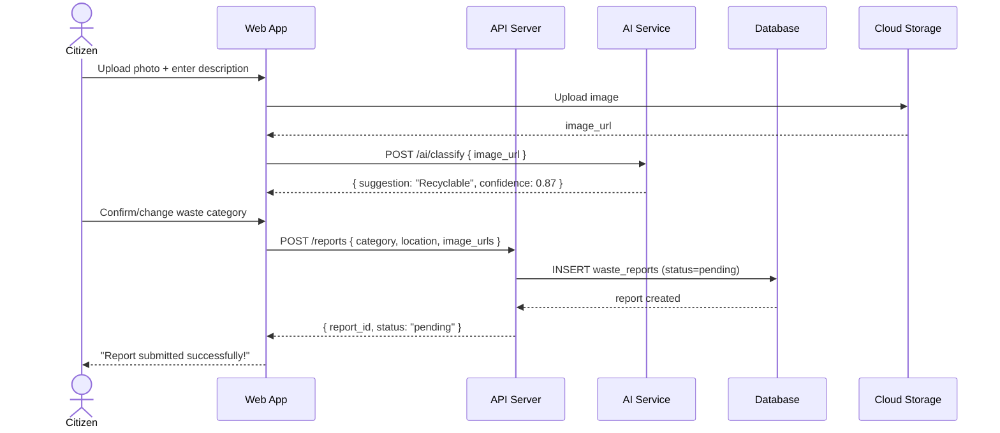
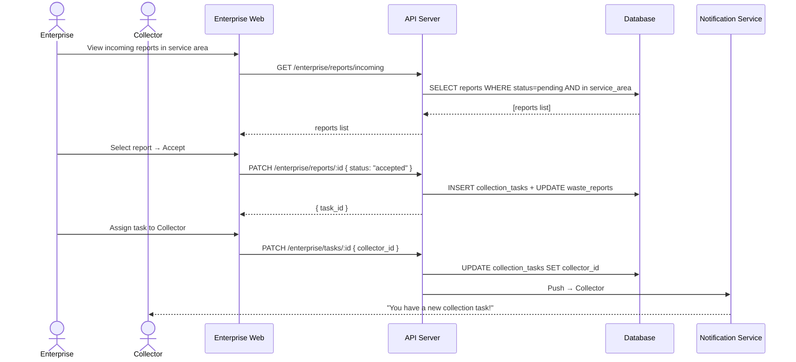
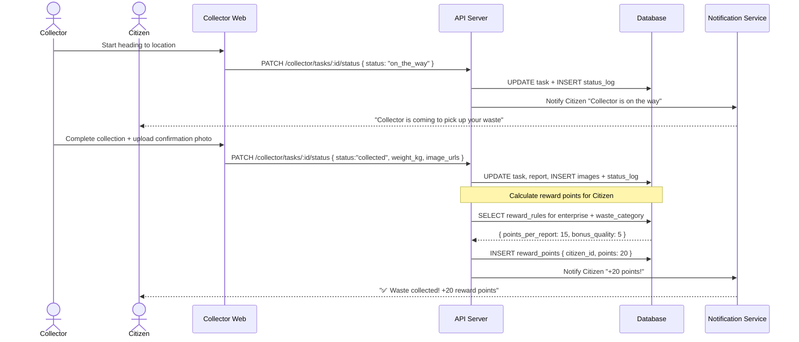
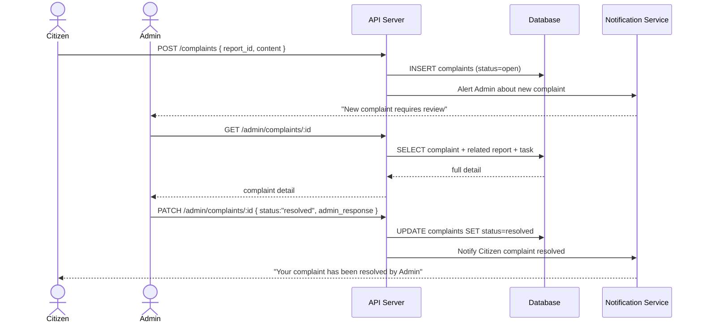

# 🗑️ Crowdsourced Waste Collection & Recycling Platform

> A web-based platform connecting **Citizens**, **Recycling Enterprises**, and **Collectors** to streamline waste reporting, collection, and reward redemption—built with C# .NET 8 + Next.js 14.

---

## ✨ Key Features

- 📸 **Citizens** report waste with GPS location, photos & optional AI classification
- 🏭 **Enterprises** accept reports within their service area and dispatch collectors
- 🚛 **Collectors** update task status in real-time and confirm collection with photos
- 🏆 **Reward system** — Citizens earn points automatically when their waste is collected
- 📊 **Admin panel** — manage users, approve enterprises, resolve complaints
- 📱 **PWA-ready** — works on mobile as a Progressive Web App

---

## 🛠️ Tech Stack

| Layer | Technology |
|---|---|
| **Backend** | C# .NET 8 — ASP.NET Core Web API (Clean Architecture + CQRS with MediatR) |
| **Frontend** | Next.js 14 (App Router) — React 18, TypeScript, Tailwind CSS |
| **Database** | MySQL 8.0 + EF Core via Pomelo provider |
| **Auth** | JWT — access token (1 h) + refresh token (30 d) |
| **State (FE)** | Zustand (auth) + TanStack Query (server state + polling) |
| **Infra** | Docker Compose — Nginx reverse proxy |
| **CI/CD** | GitHub Actions |

---

## 📋 Prerequisites

- [.NET 8 SDK](https://dotnet.microsoft.com/download/dotnet/8.0)
- [Node.js 20+](https://nodejs.org/)
- [Docker & Docker Compose](https://docs.docker.com/get-docker/) *(recommended for DB)*
- MySQL 8.0 *(or use the Docker Compose DB service)*

---

## 🚀 Getting Started

### 1. Clone the Repository

```bash
git clone https://github.com/<your-org>/waste-platform.git
cd waste-platform
```

### 2. Configure Environment Variables

```bash
cp .env.example .env
```

Edit `.env`:

| Variable | Description | Example |
|---|---|---|
| `DATABASE_URL` | MySQL connection string | `Server=localhost;Database=wasteplatform;User=root;Password=secret` |
| `JWT_SECRET` | 256-bit secret for signing JWTs | *(generate with `openssl rand -hex 32`)* |
| `JWT_EXPIRY_MINUTES` | Access token lifetime | `60` |
| `JWT_REFRESH_DAYS` | Refresh token lifetime | `30` |
| `STORAGE_BUCKET` | Cloud storage bucket name | `waste-platform-images` |
| `AI_SERVICE_URL` | Internal AI classification endpoint | `http://ai-service:8000` |

### 3. Start the Database

```bash
docker compose up -d db
```

### 4. Run Database Migrations

```bash
cd backend
dotnet ef database update --project src/WastePlatform.Infrastructure --startup-project src/WastePlatform.API
```

*(Or run the migration SQL files in `db/migrations/` manually in order.)*

### 5. Start the Backend API

```bash
cd backend
dotnet run --project src/WastePlatform.API
# API available at http://localhost:5000
# Swagger UI at  http://localhost:5000/swagger
```

### 6. Start the Frontend

```bash
cd frontend
npm install
npm run dev
# App available at http://localhost:3000
```

### 7. Full Stack with Docker Compose

```bash
docker compose up --build
```

| Service | URL |
|---|---|
| Frontend (via Nginx) | http://localhost |
| API (via Nginx) | http://localhost/api |
| Swagger | http://localhost/api/swagger |
| MySQL | localhost:3306 |

---

## 🏗️ Architecture

### Monorepo Structure

```
waste-platform/
├── backend/              # C# .NET 8 — Clean Architecture
│   ├── src/
│   │   ├── WastePlatform.Domain/         # Entities, Enums, Value Objects, Domain Events
│   │   ├── WastePlatform.Application/    # Use Cases (Commands/Queries via MediatR)
│   │   ├── WastePlatform.Infrastructure/ # EF Core, Repositories, External Services
│   │   └── WastePlatform.API/            # Controllers, Middleware, DTOs
│   └── tests/
│       ├── WastePlatform.Domain.Tests/
│       ├── WastePlatform.Application.Tests/
│       └── WastePlatform.Integration.Tests/
│
├── frontend/             # Next.js 14 (App Router)
│   └── src/
│       ├── app/
│       │   ├── (auth)/          # /login, /register
│       │   ├── (citizen)/       # /dashboard, /reports, /rewards, /complaints
│       │   ├── (enterprise)/    # /dashboard, /reports, /tasks, /analytics
│       │   ├── (collector)/     # /tasks, /history
│       │   └── (admin)/         # /dashboard, /users, /enterprises, /complaints
│       ├── components/          # Reusable UI components
│       ├── hooks/               # useAuth, useGeolocation, usePolling, ...
│       ├── lib/api/             # Axios client + per-domain API modules
│       └── types/               # Auto-generated from openapi.yaml
│
├── db/
│   ├── migrations/       # Versioned SQL migration files
│   └── seeds/            # Seed data (waste categories, admin user)
│
├── docs/                 # openapi.yaml, design docs
├── docker-compose.yml
└── .github/workflows/    # CI/CD pipelines
```

### Clean Architecture Layers

```
┌──────────────────────────────────────┐
│  Layer 4 — API (Controllers / DTOs)  │
│  Layer 3 — Infrastructure (DB / S3)  │
│  Layer 2 — Application (Use Cases)   │
│  Layer 1 — Domain (Entities / Rules) │ ← No external dependencies
└──────────────────────────────────────┘
```

Dependency rule: **outer layers depend inward, never the reverse.**

---

## 🔄 Sequence Diagrams

### 1. Citizen Creates a Waste Report (with AI Classification)



### 2. Enterprise Accepts Report & Assigns Collector



### 3. Collector Completes Collection → Citizen Earns Points



### 4. Citizen Files a Complaint → Admin Resolves



---

## 📦 Key Dependencies

### Backend (NuGet)

| Package | Purpose |
|---|---|
| `Pomelo.EntityFrameworkCore.MySql` | MySQL 8 EF Core provider |
| `MediatR` | CQRS — Commands & Queries |
| `FluentValidation` | Request validation |
| `Microsoft.AspNetCore.Authentication.JwtBearer` | JWT authentication |
| `BCrypt.Net-Next` | Password hashing |
| `Serilog` | Structured logging |
| `AspNetCoreRateLimit` | Rate limiting |
| `Swashbuckle.AspNetCore` | Swagger UI |

### Frontend (npm)

| Package | Purpose |
|---|---|
| `axios` | HTTP client with JWT interceptor |
| `zustand` | Global auth state |
| `@tanstack/react-query` | Server state, caching, polling |
| `react-hook-form` + `zod` | Form validation |
| `react-leaflet` | Interactive map + GPS picker |
| `next-pwa` | PWA support |
| `openapi-typescript` | Auto-generate types from openapi.yaml |

---

## 🔐 Authentication Flow

1. `POST /auth/register` → create account (citizen / enterprise / collector)
2. `POST /auth/login` → returns `{ accessToken, refreshToken }`
3. All protected routes require `Authorization: Bearer <accessToken>` header
4. On 401 → frontend auto-calls `POST /auth/refresh` with `refreshToken` cookie
5. Role-based access enforced via `[AuthorizeRole("citizen")]` attribute on controllers

---

## 🧪 Testing

### Backend

```bash
cd backend
# Unit + integration tests
dotnet test

# Specific project
dotnet test tests/WastePlatform.Application.Tests
```

### Frontend

```bash
cd frontend
npm test           # Jest unit tests
npm run e2e        # Playwright E2E tests (if configured)
```

---

## 🚢 Deployment

### Docker Compose (Recommended)

```bash
# Production build
docker compose -f docker-compose.yml -f docker-compose.prod.yml up -d --build
```

Nginx routes:
- `/` → `frontend:3000`
- `/api/*` → `backend:5000`

### CI/CD (GitHub Actions)

| Workflow | Trigger | Action |
|---|---|---|
| `backend-ci.yml` | Push / PR | `dotnet test` + `dotnet build` |
| `frontend-ci.yml` | Push / PR | `npm test` + `npm run build` |
| `deploy.yml` | Merge to `main` | `docker compose up` on server |

---

## 🔧 Available Commands

### Backend

```bash
dotnet run --project src/WastePlatform.API         # Start API server
dotnet test                                         # Run all tests
dotnet ef migrations add <Name> --project src/WastePlatform.Infrastructure \
  --startup-project src/WastePlatform.API          # Add migration
dotnet ef database update ...                       # Apply migrations
```

### Frontend

```bash
npm run dev        # Development server (http://localhost:3000)
npm run build      # Production build
npm run lint       # ESLint check
npm run type-check # TypeScript check
npx openapi-typescript docs/openapi.yaml -o src/types/api.ts  # Regenerate API types
```

---

## 🗂️ Environment Variables Reference

| Variable | Required | Description |
|---|---|---|
| `DATABASE_URL` | ✅ | MySQL connection string |
| `JWT_SECRET` | ✅ | 256-bit signing secret |
| `JWT_EXPIRY_MINUTES` | ✅ | Access token expiry (default: `60`) |
| `JWT_REFRESH_DAYS` | ✅ | Refresh token expiry (default: `30`) |
| `STORAGE_BUCKET` | ✅ | Cloud storage bucket name |
| `AI_SERVICE_URL` | ⚠️ Optional | AI classification service URL |

---

## 🏛️ Architecture Decision Records

| # | Decision | Rationale |
|---|---|---|
| ADR-01 | C# .NET 8 Backend | Stable LTS, strong typing, EF Core |
| ADR-02 | Next.js 14 App Router | Route groups per role, SSR, PWA ready |
| ADR-03 | Clean Architecture | Domain logic decoupled from DB/framework |
| ADR-04 | CQRS with MediatR | Clear read/write separation |
| ADR-05 | JWT stateless auth (1h + 30d) | No session store required |
| ADR-06 | MySQL 8.0 | Team familiarity; spatial queries via Haversine |
| ADR-07 | Zustand + React Query | Zustand for auth, React Query for server state |

---

## 🤝 Contributing

1. Fork the repo and create a feature branch: `git checkout -b feat/my-feature`
2. Follow the **Clean Architecture** layer rules — no domain code in API layer
3. Ensure all tests pass: `dotnet test` and `npm test`
4. Submit a Pull Request against `main`

---

## 📄 License

MIT © 2026 Waste Platform Team
